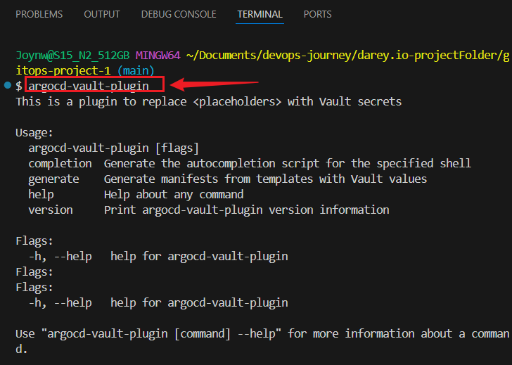

# GitOps Configuration Management with ArgoCD, Helm, Kustomize, and Vault

## Project Overview

This mini project demonstrates GitOps-based configuration management using **ArgoCD**, **Helm**, **Kustomize**, and **Vault** for secret management. The setup simulates real-world GitOps workflows with automated deployments, environment-based configurations, and secure secret injection.


## Project Structure
```bash
gitops-project
├── helm-app/
│   └── my-app/                 
│       ├── Chart.yaml
│       ├── values.yaml
│       └── templates/
├── kustomize-app/
│   ├── base/                    
│   └── overlays/
│       ├── dev/
│       └── prod/
├── argocd-apps/                  
├── vault/                     
├── .gitignore
└── README.md
```

---


## Objectives
- Integrate **Helm** charts with ArgoCD

- Manage environments with **Kustomize overlays**

- Secure secrets using **Kubernetes, Vault,** and **AWS Secrets Manager**

- Customize **resource management** and **sync policies** in ArgoCD


---

## Tools Required

- Docker Desktop (w/ Kubernetes)

- kubectl

- Helm

- Kustomize

- ArgoCD CLI

- Vault CLI

- Git

- VS Code (with Kubernetes, YAML, and Git plugins)


## Verify Installed Tools


```bash
helm version
kubectl version --client
kustomize version
vault -v
aws --version
git --version
argocd version --client
```


 ## 1: Project Folder Setup
```bash
mkdir -p gitops-project-1/{helm-app/my-app/{templates,charts},kustomize-app/my-app/{base,overlays/dev,overlays/prod},argocd-apps}
cd gitops-project-1
```


## 2: ArgoCD Setup on Local Kubernetes

### Check cluster nodes:
```bash
kubectl cluster-info
kubectl get nodes
```


###  Install ArgoCD
```bash
kubectl create namespace argocd
kubectl apply -n argocd -f https://raw.githubusercontent.com/argoproj/argo-cd/v2.9.3/manifests/install.yaml
```


### Access ArgoCD UI
```bash
kubectl port-forward svc/argocd-server -n argocd 8080:443
kubectl get svc argocd-server -n argocd
```
**Visit: `http://localhost:8080`**


### Login to ArgoCD CLI and UI

- Get the default admin password:
```bash
kubectl get secret argocd-initial-admin-secret -n argocd -o jsonpath="{.data.password}" | base64 -d && echo
argocd login localhost:8080 --username admin --password $(kubectl -n argocd get secret argocd-initial-admin-secret -o jsonpath='{.data.password}' | base64 -d) --insecure
```

**Login using:**

- Username: admin
- Password: (from the above command)


### Check ArgoCD pods:
```bash
kubectl get pods -n argocd
```

### Check node status:
```bash
kubectl get nodes
```


### Create and Push Repo to GitHub
```bash
git init
git add README.md
git commit -m "Initial project structure"
git branch -M main
git remote add origin https://github.com/YOUR_USERNAME/gitops-project.git
git push -u origin main
```

### Create .gitignore File
```bash
*.log
*.tmp
*.bak
.vault-token
__pycache__/
.DS_Store
.idea/
*.swp
.env
```


## 3: HELM: APP DEPLOYMENT

### Create Helm Chart 
```bash
helm create helm-app/my-app
```

### Clean up default chart:
```bash
rm -rf helm-app/my-app/tests
```

### Update files:

### Edit `helm-app/my-app/Chart.yaml`:

```bash
apiVersion: v2
name: my-app
description: A Helm chart for deploying My App
type: application
version: 0.1.0
appVersion: "1.0"
```


### Edit `helm-app/my-app/values.yaml`
```bash
replicaCount: 1

image:
  repository: nginx
  tag: "latest"
  pullPolicy: IfNotPresent

service:
  type: ClusterIP
  port: 80

ingress:
  enabled: false
  className: ""
  annotations: {}
  hosts:
    - host: my-app.local
      paths:
        - path: /
          pathType: Prefix
  tls: []

resources: {}

nodeSelector: {}

tolerations: []

affinity: {}

autoscaling:
  enabled: false
  minReplicas: 1
  maxReplicas: 3
  targetCPUUtilizationPercentage: 80
  targetMemoryUtilizationPercentage: 75
serviceAccount:
  create: true
  name: ""
```


### Edit `templates/deployment.yaml`
```bash
apiVersion: apps/v1
kind: Deployment
metadata:
  name: {{ .Release.Name }}
  labels:
    app: {{ .Chart.Name }}
spec:
  replicas: {{ .Values.replicaCount }}
  selector:
    matchLabels:
      app: {{ .Chart.Name }}
  template:
    metadata:
      labels:
        app: {{ .Chart.Name }}
    spec:
      containers:
        - name: {{ .Chart.Name }}
          image: "{{ .Values.image.repository }}:{{ .Values.image.tag }}"
          imagePullPolicy: {{ .Values.image.pullPolicy }}
          ports:
            - containerPort: {{ .Values.service.port }}
          resources: {{- toYaml .Values.resources | nindent 12 }}
```


### Edit `templates/service.yaml`
```bash
apiVersion: v1
kind: Service
metadata:
  name: {{ .Release.Name }}
spec:
  type: {{ .Values.service.type }}
  selector:
    app: {{ .Chart.Name }}
  ports:
    - port: {{ .Values.service.port }}
      targetPort: {{ .Values.service.port }}
```


### Edit `templates/ingress.yaml`
```bash
{{- if .Values.ingress.enabled }}
apiVersion: networking.k8s.io/v1
kind: Ingress
metadata:
  name: {{ .Release.Name }}
  annotations:
    {{- range $key, $value := .Values.ingress.annotations }}
    {{ $key }}: {{ $value | quote }}
    {{- end }}
spec:
  rules:
    {{- range .Values.ingress.hosts }}
    - host: {{ .host }}
      http:
        paths:
          {{- range .paths }}
          - path: {{ .path }}
            pathType: {{ .pathType }}
            backend:
              service:
                name: {{ $.Release.Name }}
                port:
                  number: {{ $.Values.service.port }}
          {{- end }}
    {{- end }}
{{- end }}
```


### Test Helm Chart Locally:
```bash
cd helm-app/my-app
helm lint .
helm package helm-app/my-app
```


### Commit to Git
```bash
git add helm-app/my-app
git commit -m "Add Helm chart for my-app"
git push
```

### Deploy Helm Chart in ArgoCD

### Create `argocd-apps/helm-my-app.yaml`:

### Paste
```bash
apiVersion: argoproj.io/v1alpha1
kind: Application
metadata:
  name: helm-my-app
  namespace: argocd
spec:
  project: default
  source:
    repoURL: https://github.com/<your-user>/<repo>.git
    targetRevision: main
    path: helm-app/my-app
    helm:
      valueFiles:
        - values.yaml
  destination:
    server: https://kubernetes.default.svc
    namespace: default
  syncPolicy:
    automated:
      selfHeal: true
      prune: true
```

### Apply it:
```bash
kubectl apply -f argocd-apps/helm-my-app.yaml
```


### Push to GitHub
```bash
git add argocd-apps/helm-my-app.yaml
git commit -m "argocd-apps/helm-my-app.yaml"
git push origin main
```


### Verify the Application in ArgoCD
- Check it via CLI:
```bash
kubectl get applications -n argocd
```


### Verify Deployment
```bash
kubectl get deployments
kubectl get pods
kubectl get svc
```


- Or Open the ArgoCD UI
```bash
kubectl port-forward svc/argocd-server -n argocd 8080:443
```
**Check on Browser `https://localhost:8080`**


### Access NGINX app (helm-my-app):
```bash
kubectl port-forward svc/helm-my-app 8081:80
```
**Then go to:`http://localhost:8081`**


## 4: Kustomize App Setup

- Create Kustomize base:
```bash
mkdir -p kustomize-app/my-app/base
```

### `base/kustomization.yaml`
```bash
resources:
  - deployment.yaml
  - service.yaml
```

### base/deployment.yaml
```bash
apiVersion: apps/v1
kind: Deployment
metadata:
  name: kustomize-app
spec:
  replicas: 1
  selector:
    matchLabels:
      app: kustomize-app
  template:
    metadata:
      labels:
        app: kustomize-app
    spec:
      containers:
        - name: nginx
          image: nginx:latest
          ports:
            - containerPort: 80
```


### `base/service.yaml`
```bash
apiVersion: v1
kind: Service
metadata:
  name: kustomize-app
spec:
  type: ClusterIP
  selector:
    app: kustomize-app
  ports:
    - port: 80
      targetPort: 80
```

## 5: Add Overlays

### `overlays/dev/kustomization.yaml`
```bash
resources:
  - ../../base
patchesStrategicMerge:
  - patch.yaml
```

### `overlays/dev/patch.yaml`
```bash
apiVersion: apps/v1
kind: Deployment
metadata:
  name: kustomize-app
spec:
  replicas: 2
```

**Duplicate `overlays/dev` for `overlays/prod` and set `replicas: 3`**

### overlays/prod/kustomization.yaml
```bash
resources:
  - ../../base
patchesStrategicMerge:
  - patch.yaml
```

### overlays/prod/patch.yaml
```bash
apiVersion: apps/v1
kind: Deployment
metadata:
  name: kustomize-app
spec:
  replicas: 3
```

### Test and Commit Kustomize Configurations:

```bash
cd kustomize-app/my-app/base
kustomize build .
git add kustomize-app/my-app
git commit -m "Add Kustomize base and overlays"
git push
```


## Deploy Kustomize App via ArgoCD

- Create argocd-apps/kustomize-my-app-dev.yaml:

```bash
apiVersion: argoproj.io/v1alpha1
kind: Application
metadata:
  name: kustomize-my-app-dev
  namespace: argocd
spec:
  project: default
  source:
    repoURL: https://github.com/YOUR_USERNAME/gitops-project.git
    targetRevision: main
    path: kustomize-app/my-app/overlays/dev
  destination:
    server: https://kubernetes.default.svc
    namespace: default
  syncPolicy:
    automated:
      selfHeal: true
      prune: true
```


### Apply it:
```bash
kubectl apply -f argocd-apps/kustomize-my-app-dev.yaml
```


### Run in the Right Environment

### Enter WSL Ubuntu
```bash
wsl
```

### Verify Docker & Kind 
```bash
docker --version
kind version
```


### Create the Kind Cluster
```bash
kind create cluster
```


### Confirm it’s running
```bash
kubectl get nodes
```


### Load your Docker image
```bash
mkdir -p ~/images
cd ~/images
docker save nginx:1.25.2 -o nginx.tar
kind load docker-image nginx:1.25.2
```


### Update Deployment to Use That Image
```bash
image: nginx:1.25.2
```


### Push to GitHub
```bash
git add .
git commit -m "Use nginx:1.25.2 for Kustomize app"
git push
```


### Confirm in ArgoCD:
```bash
kubectl get applications -n argocd
```


### Verify Deployment 
```bash
kubectl get pods
kubectl logs <pod-name>
```


Or

###  Port Forward to Test Locally:
- Port Forward One of Your Running Pods

- Forward from helm-my-app:
```bash
kubectl port-forward pod/helm-my-app-684797d6d4-cwvkt 8080:80
```
**Then open:`http://localhost:8080`**


- Forward from `kustomize-app:`
```bash
kubectl port-forward pod/kustomize-app-6f45c44745-hg4r4 8081:80
```
**Then go to: `http://localhost:8081`**


### ArgoCD Sync Check

- Check sync status:
```bash
kubectl get applications -n argocd
```


### Log into ArgoCD UI:
```bash
kubectl port-forward svc/argocd-server -n argocd 8080:443
```
**Then open: `https://localhost:8080`**


### Push to GitHub

```bash
git status
git add .
git commit -m "Deploy nginx with ArgoCD and port-forward enabled"
git push origin main
```


## 6: Secrets Management in Kubernetes
- Create Kubernetes Secret:
```bash
kubectl create secret generic my-secret --from-literal=password=mypassword
```

### Reference in Deployment Manifest:
```bash
env:
  - name: DB_PASSWORD
    valueFrom:
      secretKeyRef:
        name: my-secret
        key: password
```


### Validate and Push to GitHub:
```bash
cd helm-app/my-app
helm lint .
cd ../..
git add .
git commit -m "Use Vault reference for secrets"
git push origin main
```

### ArgoCD Sync :
```bash
argocd login localhost:8080 --username admin --password <argocd-password>
argocd app list
kubectl port-forward svc/helm-my-app 8080:80
argocd app sync <your-app-name>
```


### Port-Forward Application

#### port-forward the Helm app:
```bash
kubectl get svc
kubectl port-forward svc/<actual-service-name> 8080:80
```
**Verify:`http://localhost:8080`**


#### To port-forward the Kustomize app:
```bash
kubectl port-forward svc/kustomize-app 8081:80
```
**Verify: `http://localhost:8081`**


### Port-forward ArgoCD Server
```bash
kubectl port-forward svc/argocd-server -n argocd 8080:443
```

### Log in to ArgoCD CLI
```bash
argocd login localhost:8080 --username admin --password <your-password> --insecure
kubectl get pods -n argocd -l app.kubernetes.io/name=argocd-server -o name
```
**Copy the pod name (argocd-server-XXXXXXX) and use that as the password.**

### Sync the app again
```bash
argocd app sync helm-my-app
argocd app sync kustomize-my-app-dev
```


### Port-Forward Services for Easy Access on Browser:

#### For the Helm app:
```bash
kubectl port-forward svc/helm-my-app 8080:80
```
**Visit in browser: `http://localhost:8080`**


### For the Kustomize app:
```bash
kubectl port-forward svc/kustomize-app 8081:80
```
**Visit in browser: `http://localhost:8081`**


### View Secret content (Base64 decoded)
```bash
kubectl get secret my-secret -o yaml
```

### Then decode:
```bash
echo bXlwYXNzd29yZA== | base64 --decode
```


 ## 7: Test GitHub Push (CI/CD Trigger Check)

### Update the replicaCount in `helm-app/my-app/values.yaml`:

```bash
replicaCount: 2
```

### Commit & push:
```bash
git add helm-app/my-app/values.yaml
git commit -m "Increase replica count to 2"
git push origin main
```

### Confirm the Change is Deployed
```bash
argocd app sync helm-my-app
kubectl get pods
```


## 8:  Integrate HashiCorp Vault
- Install Vault (dev mode):
```bash
vault server -dev
```


### Export Vault Env Vars
```bash
export VAULT_ADDR='http://127.0.0.1:8200'
export VAULT_TOKEN='root'
```


### Store a secret in Vault:
```bash
vault kv put secret/myapp password=mypassword
```

### Verify Secret is Stored
```bash
vault kv get secret/myapp
```


### Start Vault
```bash
http://127.0.0.1:8200
```


### Create a Vault Policy

- Create a policy file, `argocd-policy.hcl`:
```bash
path "secret/data/myapp" {
  capabilities = ["read"]
}
```


### Apply the policy:
```bash
vault policy write argocd-policy argocd-policy.hcl
```

### Generate Vault Token for ArgoCD

- Create a token bound to the argocd-policy:
```bash
vault token create -policy=argocd-policy -format=json
```
**Copy the client_token from the JSON output.**


### Create Kubernetes Secret for the Token
```bash
kubectl create secret generic avp-vault-token \
  -n argocd \
  --from-literal=token=<your-client-token-here>
```


### Patch ArgoCD Repo Server
- Set environment variables so argocd-vault-plugin can access Vault.
```bash
kubectl edit deployment argocd-repo-server -n argocd
```


### Inside `spec.template.spec.containers.env`, add this block:
```bash
        - name: AVP_TYPE
          value: vault
        - name: AVP_AUTH_TYPE
          value: token
        - name: AVP_VAULT_ADDR
          value: http://host.docker.internal:8200 
        - name: AVP_VAULT_TOKEN
          valueFrom:
            secretKeyRef:
              name: avp-vault-token
              key: token
```

### Restart:
```bash
kubectl rollout restart deployment argocd-repo-server -n argocd
```


### Prepare your Kubernetes manifest

- Create a manifest. this placeholder `<path:secret/data/myapp#password>` will be replaced at runtime by AVP with the Vault secret value.

`myapp-deployment.yaml`
```bash
apiVersion: v1
kind: Secret
metadata:
  name: myapp-secret
type: Opaque
stringData:
  password: <path:secret/data/myapp#password>
```

### Reference the plugin in your ArgoCD Application

## Update `argocd-apps/helm-my-app.yaml`
```bash
spec:
  source:
    plugin:
      name: avp-plugin
```

### Ensure AVP Plugin Config Exists

`argocd-apps/.argocd-source-plugin.yaml`:
```bash
apiVersion: v1
kind: ConfigMap
metadata:
  name: argocd-cm
  namespace: argocd
data:
  configManagementPlugins: |
    - name: avp-helm
      init:
        command: ["/bin/sh", "-c"]
        args: ["helm dependency build"]
      generate:
        command: [ "argocd-vault-plugin" ]
        args: [ "generate", "." ]
```


### Use AVP in Your Helm Deployment

`helm-app/my-app/templates/deployment.yaml`
```bash
env:
  - name: DB_PASSWORD
    value: <path:secret/data/myapp#password>
```


### Push Changes to GitHub
```bash
git add .
git commit -m "Configure AVP in Helm deployment and ArgoCD"
git push origin main
```

### Verify Secret in Pod
```bash
kubectl exec -it deploy/<your-app-name> -- printenv | grep DB_PASSWORD
kubectl edit deployment argocd-repo-server -n argocd
depl
 kubectl create secret generic avp-vault-token \
  --from-literal=token=><password> \
  -n argocd
```

### Create a Kubernetes ConfigMap with the plugin binary

```bash
curl -Lo argocd-vault-plugin https://github.com/argoproj-labs/argocd-vault-plugin/releases/latest/download/argocd-vault-plugin_linux_amd64
chmod +x argocd-vault-plugin
kubectl create configmap avp-plugin \
  --from-file=argocd-vault-plugin=~/go/bin/argocd-vault-plugin \
  -n argocd
```


 ### Patch the argocd-repo-server to mount the plugin
 ```bash
 kubectl -n argocd patch deployment argocd-repo-server --type=json -p='[
  {
    "op": "add",
    "path": "/spec/template/spec/initContainers/-",
    "value": {
      "name": "install-plugins",
      "image": "busybox",
      "command": ["/bin/sh", "-c"],
      "args": ["cp /avp/argocd-vault-plugin /custom-tools/argocd-vault-plugin && chmod +x /custom-tools/argocd-vault-plugin"],
      "volumeMounts": [
        {
          "name": "avp-plugin",
          "mountPath": "/avp"
        },
        {
          "name": "custom-tools",
          "mountPath": "/custom-tools"
        }
      ]
    }
  },
  {
    "op": "add",
    "path": "/spec/template/spec/containers/0/volumeMounts/-",
    "value": {
      "name": "custom-tools",
      "mountPath": "/custom-tools"
    }
  },
  {
    "op": "add",
    "path": "/spec/template/spec/volumes/-",
    "value": {
      "name": "avp-plugin",
      "configMap": {
        "name": "avp-plugin",
        "defaultMode": 493
      }
    }
  },
  {
    "op": "add",
    "path": "/spec/template/spec/volumes/-",
    "value": {
      "name": "custom-tools",
      "emptyDir": {}
    }
  }
]'
```

### Apply the Patch
```bash
kubectl -n argocd patch configmap argocd-cm \
  --type merge \
  -p '{"data":{"configManagementPlugins":"- name: avp-helm\n  init:\n    command: [\"/bin/sh\", \"-c\"]\n    args: [\"helm dependency build\"]\n  generate:\n    command: [\"argocd-vault-plugin\"]\n    args: [\"generate\", \".\"]"}}'
```


 ### Restart repo serve
```bash
kubectl -n argocd rollout restart deployment argocd-repo-server
```


### Verify Vault Plugin
```bash
argocd-vault-plugin
```



### Recreate the ConfigMap with the Correct Binary and Restart
```bash
kubectl -n argocd create configmap avp-plugin \
  --from-file=argocd-vault-plugin \
  --dry-run=client -o yaml | kubectl apply -f -
kubectl -n argocd rollout restart deployment argocd-repo-server
```


### Verify Pod Restart & Plugin Injection
```bash
kubectl -n argocd get pods -l app.kubernetes.io/name=argocd-repo-server
```

### Apply 
```bash
kubectl apply -f path/to/your-file.yaml
```

### Commit and push the change to GitHub:
```bash
git add path/to/your-file.yaml
git commit -m "Fix: set ArgoCD repo-server image to v2.9.3"
git push origin main
```

### Sync the ArgoCD Application (either via UI or CLI):
```bash
argocd app sync <your-app-name>
```


## 9: Integrating ArgoCD with AWS Secrets Manager using External Secrets Operator (ESO)

- Install External Secrets Operator:
```bash
aws configure
helm repo add external-secrets https://charts.external-secrets.io
helm install external-secrets external-secrets/external-secrets \
  --namespace external-secrets --create-namespace --set installCRDs=true
```


## Store a Secret in AWS Secrets Manager & IAM Policy

```bash
aws secretsmanager create-secret \
  --name myapp/db-credentials \
  --secret-string '{"DATABASE_PASSWORD":"your-db-password"}'
```

### Create IAM Policy for Secrets Access
- Create a JSON policy allowing only read access to that specific secret.
```bash
touch secrets-access-policy.json
```

### Paste
```bash
{
  "Version": "2012-10-17",
  "Statement": [
    {
      "Effect": "Allow",
      "Action": "secretsmanager:GetSecretValue",
      "Resource": "arn:aws:secretsmanager:<region>:<account-id>:secret:myapp/db-credentials*"
    }
  ]
}
```


### Create the policy:
```bash
aws iam create-policy \
  --policy-name ReadMyAppSecretPolicy \
  --policy-document file://secrets-access-policy.json
```


### Attach the policy to the IAM role created by eksctl
```bash
aws iam attach-role-policy \
  --role-name eksctl-my-eks-cluster-addon-iamserviceaccount-argocd-external-secrets-sa-Role1-<xxxx> \
  --policy-arn arn:aws:iam::<ACCOUNT_ID>:policy/ReadMyAppSecretPolicy
```


### Find the IAM role name
```bash
eksctl get iamserviceaccount --cluster my-eks-cluster --name external-secrets-sa --namespace argocd
```


### Create EKS (Elastic Kubernetes Service) cluster
```bash
eksctl create cluster \
  --name my-eks-cluster \
  --region us-east-1 \
  --nodes 2 \
  --managed
```


### Create IAM Role for Kubernetes via IRSA
- Create a role that Kubernetes ServiceAccounts can assume.

```bash
eksctl create iamserviceaccount \
  --utils associate-iam-oidc-provider \
  --name external-secrets-sa \
  --namespace argocd \
  --cluster <your-cluster-name> \
  --attach-policy-arn arn:aws:iam::<account-id>:policy/ReadMyAppSecretPolicy \
  --approve
```


### Create a Kubernetes ServiceAccount bound to the IAM role
```bash
apiVersion: v1
kind: ServiceAccount
metadata:
  name: external-secrets-sa
  namespace: argocd
  annotations:
    eks.amazonaws.com/role-arn: arn:aws:iam::<account-id>:role/<role-name>
```


### Create iamserviceaccount
```bash
eksctl create iamserviceaccount \
  --name external-secrets-sa \
  --namespace argocd \
  --cluster my-eks-cluster \
  --attach-policy-arn arn:aws:iam::<account-no>:policy/ReadMyAppSecretPolicy \
  --approve
```


### Create a SecretStore
`secretstore.yaml`
```bash
apiVersion: external-secrets.io/v1beta1
kind: SecretStore
metadata:
  name: aws-secret-store
  namespace: argocd
spec:
  provider:
    aws:
      service: SecretsManager
      region: us-east-1
      auth:
        jwt:
          serviceAccountRef:
            name: external-secrets-sa
```

### Apply:
```bash
kubectl apply -f secretstore.yaml
```

### Create the ExternalSecret Resource

`externalsecret.yaml`

```bash
apiVersion: external-secrets.io/v1beta1
kind: ExternalSecret
metadata:
  name: db-secret
  namespace: argocd
spec:
  refreshInterval: 1h
  secretStoreRef:
    name: aws-secret-store
    kind: SecretStore
  target:
    name: db-secret
    creationPolicy: Owner
  data:
    - secretKey: DATABASE_PASSWORD
      remoteRef:
        key: myapp/db-credentials
        property: DATABASE_PASSWORD
```

### Apply:
```bash
 kubectl apply -f secretstore.yaml
 ```
 


### Get the full details of the CRD and confirm the correct version:
```bash
kubectl get crd externalsecrets.external-secrets.io -o jsonpath='{.spec.versions[*].name}'
```


### Apply externalsecret:
```bash
kubectl apply -f externalsecret.yaml
```


### Verify the secret was created:
```bash
kubectl get externalsecret -n argocd
kubectl get secret db-secret -n argocd
```

### Confirm the Secret was Created
```bash
kubectl get secret db-secret -n argocd -o yaml
```


### Integrate AWS Secrets Manager with ArgoCD via External Secrets

- Store Secrets in AWS
```bash
aws secretsmanager create-secret --name myapp/password --secret-string "mypassword"
```

### Install External Secrets Operator
```bash
kubectl apply -f https://github.com/external-secrets/external-secrets/releases/latest/download/crds.yaml
kubectl apply -f https://github.com/external-secrets/external-secrets/releases/latest/download/operator.yaml
```

### Clone and apply with Kustomize
```bash
git clone https://github.com/external-secrets/external-secrets.git
cd external-secrets
kubectl apply -k config/default
```


### Get AWS Access Keys & Encode
- Create or Use an IAM User
  - Go to the AWS Console → IAM → Users

  - Select an existing user or create a new one

  - Attach a policy like SecretsManagerReadWrite or SecretsManagerReadOnly

  - Under "Security credentials", click "Create access key and secret access key"


### Base64 Encode Credentials
```bash
echo -n 'YOUR_ACCESS_KEY' | base64
echo -n 'YOUR_SECRET_KEY' | base64
```


### Create Kubernetes Secret

- Create aws-secret.yaml:
```bash
apiVersion: v1
kind: Secret
metadata:
  name: aws-credentials
  namespace: external-secrets
type: Opaque
data:
  access-key: <base64-encoded-access-key>
  secret-access-key: <base64-encoded-secret-access-key>
```

### Apply:
```bash
kubectl apply -f aws-secret.yaml
```

### Update ExternalSecret to Use the ClusterSecretStore

- Create `externalsecret.yaml`:
```bash
apiVersion: external-secrets.io/v1beta1
kind: ExternalSecret
metadata:
  name: my-secret
  namespace: default
spec:
  refreshInterval: 1h
  secretStoreRef:
    name: aws-secret-store
    kind: ClusterSecretStore
  target:
    name: my-secret
    creationPolicy: Owner
  data:
    - secretKey: password
      remoteRef:
        key: myapp/password
```


### Apply and Verify the Secret:
```bash
kubectl apply -f externalsecret.yaml
kubectl get secret myapp-password -n default -o jsonpath='{.data.password}'   
| base64 -d
```


### Install External Secrets Operator via Helm
- Add the External Secrets Helm repository
```bash
helm upgrade external-secrets external-secrets/external-secrets \
  -n external-secrets
helm install external-secrets \
  external-secrets/external-secrets \
  -n external-secrets --create-namespace
```


### Verify the installation:
```bash
kubectl get crds | grep external-secrets.io
```


### Verify Secret Contents
```bash
kubectl describe externalsecret myapp-password -n default
kubectl get secrets -n default
kubectl get clustersecretstore aws-secrets-store
kubectl get secret myapp-secret -n default -o jsonpath='{.data.password}' | base64 --decode
```


### Verify the AWS secret:
```bash
aws secretsmanager describe-secret --secret-id myapp/password --region <your-aws-region>
```


## Customize argocd-cm ConfigMap

- Add ArgoCD Helm Repository:
```bash
helm repo add argo https://argoproj.github.io/argo-helm
helm repo update
```

### Add ArgoCD Helm Repository
```bash
helm install argocd argo/argo-cd --namespace argocd --create-namespace
```


### Verify Installation:

- Check deployments
```bash
kubectl get deployments -n argocd
```

### Check pods:
```bash
kubectl get pods -n argocd
```


### Create argocd-cm.yaml
```bash
mkdir -p argocd-apps
nano argocd-apps/argocd-cm.yaml
```


### Paste
```bash
apiVersion: v1
kind: ConfigMap
metadata:
  name: argocd-cm
  namespace: argocd
  labels:
    app.kubernetes.io/managed-by: Helm
  annotations:
    meta.helm.sh/release-name: argocd
    meta.helm.sh/release-namespace: argocd
data:
  resource.customizations: |
    external-secrets.io/ExternalSecret:
      health.lua: |
        hs = {}
        if obj.status ~= nil then
          for i, condition in ipairs(obj.status.conditions) do
            if condition.type == "Ready" and condition.status == "True" then
              hs.status = "Healthy"
              hs.message = condition.message or "ExternalSecret is ready"
              return hs
            end
          end
          hs.status = "Degraded"
          hs.message = "ExternalSecret is not ready"
        else
          hs.status = "Degraded"
          hs.message = "Status not found"
        end
        return hs
  resource.ignoreDifferences: |
    - group: networking.k8s.io
      kind: Ingress
      jsonPointers:
        - /metadata/annotations
```


### Apply:
```bash
kubectl apply -f argocd-apps/argocd-cm.yaml
```


### Restart and Verify ArgoCD:
```bash
kubectl rollout restart deployment argocd-repo-server -n argocd
kubectl rollout restart deployment argocd-application-controller -n argocd
kubectl rollout restart statefulset argocd-application-controller -n argocd
kubectl get pods -n argocd
kubectl get externalsecret myapp-password -n default
kubectl get clustersecretstore aws-secrets-store
```


### Create application.yaml:
```bash
nano application.yaml
```

### Paste:
```bash
apiVersion: argoproj.io/v1alpha1
kind: Application
metadata:
  name: myapp
  namespace: argocd
spec:
  project: default
  source:
    repoURL: <your-git-repo-url>
    targetRevision: main
    path: .
  destination:
    server: https://kubernetes.default.svc
    namespace: default
  syncPolicy:
    automated:
      prune: true
      selfHeal: true
    syncOptions:
      - Validate=true
      - CreateNamespace=true
  ignoreDifferences:
  - group: ""
    kind: Secret
    name: myapp-secret
    jsonPointers:
    - /data
```


### Apply:
```bash
kubectl apply -f application.yaml
```


### Create myapp-pod.yaml

```bash
apiVersion: v1
kind: Pod
metadata:
  name: myapp-pod
  namespace: default
spec:
  containers:
  - name: myapp
    image: nginx:latest
    env:
    - name: APP_PASSWORD
      valueFrom:
        secretKeyRef:
          name: myapp-secret
          key: password
```


### Create myapp-pod.yaml :
```bash
nano myapp-pod.yaml
```

### Paste:
```bash
yamlapiVersion: v1
kind: Pod
metadata:
  name: myapp-pod
  namespace: default
spec:
  containers:
  - name: myapp
    image: nginx:latest
    env:
    - name: APP_PASSWORD
      valueFrom:
        secretKeyRef:
          name: myapp-secret
          key: password
```

### Apply:
```bash
kubectl apply -f app/myapp-pod.yaml
```

### Commit Files to Git

```bash
git add externalsecret.yaml clustersecretstore.yaml application.yaml argocd/argocd-cm.yaml myapp-pod.yaml
git commit -m "Add ArgoCD application, ExternalSecret, ClusterSecretStore, ConfigMap, and pod"
git push origin main
```

### Verify ArgoCD Components:
```bash
kubectl get all -n argocd
kubectl logs -n argocd -l app.kubernetes.io/name=argocd-repo-server
```
